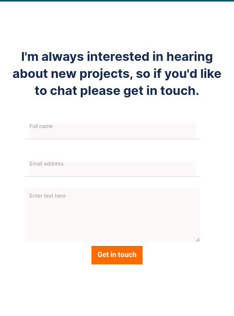

# Portfolio

> This is my first portfolio skeleton.

- In this project I made the main page's skeleton for the portfolio that will show all my future projects.
  This is the first milestone, and it is for mobile devices.
- For second milestone I added two more sections, called works and about me. Works section was built with CSS Grid and Flexbox.
- For third milestone I added form contact with my coding partner via "Pair Programming" session.
- For fourth milestone I create the desktop version frome the same code, making it responsive. 

## Built With

- HTML & CSS
- Visual Studio Code
- Linters

## Live Demo 🖥️ 💻 📱

https://alexrs90.github.io/Portfolio/

## Author 👤

👤 **Alejandro Ramos**

- GitHub: [@githubhandle](https://github.com/AlexRS90)
- Twitter: [@twitterhandle](https://twitter.com/AlejandroRBenji)
- LinkedIn: [LinkedIn](https://www.linkedin.com/in/alejandro-ramos-santos-9b0b52135/)

## 🤝 Contributing

Contributions, issues, and feature requests are welcome!

Feel free to check the [issues page](https://github.com/AlexRS90/Portfolio/issues).

## Show your support

Give a ⭐️ if you like this project!

## Acknowledgments

- Hat tip to anyone whose code was used
- Inspiration
- etc
- Contributor
  👤 **Amr Ahmed**

- GitHub: [@Amrhub](https://github.com/Amrhub/)
- LinkedIn: [Amr Ahmed](https://www.linkedin.com/in/amr-ahmed-655420191/)

👤 **Anibal Amoroso**

- GitHub: [@sj1978](https://github.com/sj1978)
